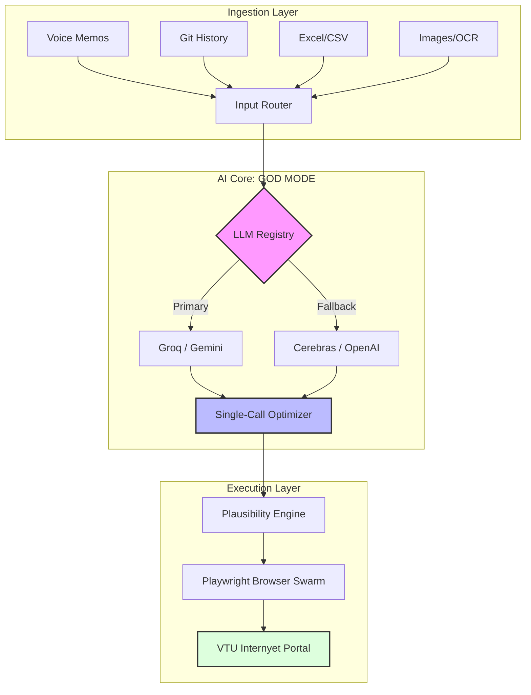

# VTU Diary Automation v3.0 — GOD MODE

<div align="center">



**Industrial-grade internship diary generation and automated submission for VTU's Internyet portal.**

[Getting Started](#-quick-start) | [Architecture](#-architecture) | [Settings](#-settings--credentials) | [Docker](#-docker-deployment)

</div>

---

### Core Capabilities

| **Universal Ingestion** | **AI Intelligence** | **Swarm Execution** |
| :--- | :--- | :--- |
| **All-Input Processing** <br> Accepts voice memos, Excel logs, git histories, and document scans without configuration. | **Multi-LLM Fallback** <br> Seamless transitions between Groq, Gemini, Cerebras, and OpenAI to ensure 100% uptime. | **Playwright Automation** <br> High-speed submission using recorded browser selectors and session state management. |
| **Plausibility Guard** <br> Real-time scoring system that prevents generation of overly "AI-sounding" or repetitive entries. | **Single-Call Logic** <br> Generates months of structured records in one API request to minimize latency and token usage. | **Self-Healing UI** <br> Dynamic detection of portal changes with auto-fixing button triggers and form dispatching. |

---

## Settings & Credentials

### Client-Side Security Model

**All credentials stay in your browser.** Nothing is stored on the server.

```
Browser (localStorage)          Backend (stateless)
┌─────────────────────┐         ┌──────────────────┐
│  API Keys           │  ──X-*──>  extract_credentials()
│  Portal Login       │  headers │  uses per-request │
│  Provider Preference│         │  never persists   │
└─────────────────────┘         └──────────────────┘
```

**How it works:**
1. Users enter API keys and portal credentials in the **Settings** page
2. Credentials are saved to `localStorage` (browser-only, per device)
3. Every API request injects them as `X-*` headers automatically
4. Backend reads headers per-request, never stores them

**This means:**
- Safe for shared/hosted deployments (Vercel, Railway, etc.)
- Each user brings their own API keys and portal login
- No risk of credential leaking between users
- Server `.env` keys serve as optional fallback defaults

### Configuration Options

**Option A: Browser Settings (recommended for shared hosting)**
1. Open the app and go to Settings in the sidebar
2. Enter your LLM API key(s) and VTU portal credentials
3. Click Save — stored in your browser only

**Option B: Environment Variables (for self-hosting)**
Copy `.env.example` to `.env` and fill in:
```bash
GROQ_API_KEY=gsk_xxxxx          # Free: 14,400 req/day
GEMINI_API_KEY=AIza_xxxxx       # Free: 20 req/day
VTU_EMAIL=student@vtu.ac.in
VTU_PASSWORD=your_password
```

**Priority:** Browser settings > Environment variables

---

## Quick Start

### 1. Install Dependencies
```bash
# Backend
cd backend
pip install -r requirements.txt
playwright install chromium

# Frontend
cd ../frontend
npm install && npm run build
```

### 2. Run
```bash
cd backend
python app.py
# Open http://localhost:5000
```

### 3. Configure
- First launch shows a popup if no AI keys are configured
- Go to **Settings** in the sidebar to enter your API keys
- Or create a `.env` file for server-side defaults

### Development Mode
```bash
# Terminal 1: Frontend with hot reload
cd frontend && npm run dev      # http://localhost:3000

# Terminal 2: Backend API
cd backend && python app.py     # http://localhost:5000
```

---

## Supported Input Formats

| Format | Capability |
| :--- | :--- |
| **Audio (.mp3, .wav)** | Whisper-powered transcription of voice notes into structured task logs. |
| **Excel / CSV** | Auto-header detection for Date, Task, Duration, and Skills columns. |
| **Git Repositories** | Automatic extraction of commit messages and PR descriptions. |
| **PDF / Text** | Deep parsing of weekly reports or meeting minutes into daily segments. |

---

## Architecture

### Intelligence Pipeline

1. **Mapping** — Distributes raw tasks across the selected calendar range, honoring weekends and holidays.
2. **Synthesis** — A monolithic LLM call generates the entire diary period, ensuring narrative consistency.
3. **Plausibility** — Analyzes word count, skill relevance, and repetition to ensure entries are realistic.
4. **Submission** — Orchestrates a sequential Playwright swarm for portal login and form submission.

### Credential Flow

```
User's Browser                    Backend Server
├── Settings Page                 ├── routes.py
│   └── localStorage.save()       │   └── extract_credentials(request)
│                                 │       ├── X-Groq-Key → groq_api_key
├── api.ts                        │       ├── X-Portal-User → portal_user
│   └── authFetch()               │       └── falls back to .env values
│       └── injects X-* headers   │
│                                 ├── ai/agent.py
│                                 │   └── uses credentials per-request
│                                 └── automation/submission_engine.py
│                                     └── uses credentials per-request
```

### File Structure

```
VTU-sel/
├── .env.example                  # Server-side config template
├── docker-compose.yml            # Full-stack Docker setup
├── Dockerfile                    # Backend container
│
├── frontend/                     # React + Vite + Tailwind
│   └── src/
│       ├── pages/                # Dashboard, Upload, Preview, Progress, History, Settings
│       ├── components/           # Modal, FileDropzone, CalendarPicker, etc.
│       └── lib/
│           ├── api.ts            # API client (auto-injects credential headers)
│           ├── credentials.ts    # localStorage credential manager
│           └── useModal.ts       # Reusable modal hook
│
├── backend/                      # FastAPI + Playwright
│   ├── app.py                    # Main server
│   ├── config.py                 # Env var config + get_effective_setting()
│   └── src/
│       ├── api/routes.py         # Endpoints + extract_credentials()
│       ├── ai/                   # LLM integration
│       ├── automation/           # Browser automation
│       └── db/                   # SQLAlchemy models
│
└── static/                       # Built frontend (from npm run build)
```

---

## Docker Deployment

### Quick Start

```bash
# 1. (Optional) Create .env for server-side defaults
cp .env.example .env

# 2. Build and run
docker-compose up --build

# 3. Open http://localhost:5000
# 4. Configure API keys in Settings page
```

### Services

| Service | Role |
| :--- | :--- |
| `frontend-build` | Builds React app, outputs to `static/` |
| `backend` | FastAPI server on port 5000 |

### Commands

```bash
docker-compose up --build       # Build and start
docker-compose up -d            # Run in background
docker-compose logs -f backend  # View logs
docker-compose down             # Stop
docker-compose down -v          # Stop + remove volumes
```

### Hosted Deployment (Vercel, Railway, etc.)

- **No `.env` file needed** — users configure via browser Settings page
- Each user's credentials stay in their own browser
- Server is completely stateless for credentials
- Set `API_HOST=0.0.0.0` and `API_PORT=5000` in hosting platform env

---

## API Reference

| Endpoint | Method | Auth Headers | Description |
|----------|--------|:---:|-------------|
| `/api/upload-file` | POST | | Upload file for processing |
| `/api/upload-text` | POST | | Upload raw text |
| `/api/generate-preview` | POST | LLM keys | Generate diary entries |
| `/api/approve-and-submit` | POST | Portal creds | Submit to VTU portal |
| `/api/progress/{id}` | GET | | Submission progress |
| `/api/history` | GET | | Submission history |
| `/api/history/stats` | GET | | Statistics |
| `/ws/progress/{id}` | WS | | Real-time progress |
| `/health` | GET | | Health check |
| `/docs` | GET | | Swagger API docs |

### Credential Headers

| Header | Purpose | Env Fallback |
|--------|---------|:---:|
| `X-Groq-Key` | Groq API key | `GROQ_API_KEY` |
| `X-Gemini-Key` | Gemini API key | `GEMINI_API_KEY` |
| `X-Cerebras-Key` | Cerebras API key | `CEREBRAS_API_KEY` |
| `X-Openai-Key` | OpenAI API key | `OPENAI_API_KEY` |
| `X-LLM-Provider` | Preferred provider | `LLM_PROVIDER` |
| `X-Portal-User` | VTU username | `VTU_EMAIL` |
| `X-Portal-Pass` | VTU password | `VTU_PASSWORD` |

---

## Troubleshooting

- **"No AI API keys found" popup** — Go to Settings, enter at least one LLM API key
- **Submission Failed** — Check portal credentials in Settings
- **Quota Exceeded** — Auto-fallback to next provider. Add multiple keys for resilience.
- **Docker Issues** — Ensure 2GB+ RAM for Playwright browser instances.

---

<div align="center">
Built with Playwright, FastAPI, and React. MIT Licensed.
</div>
